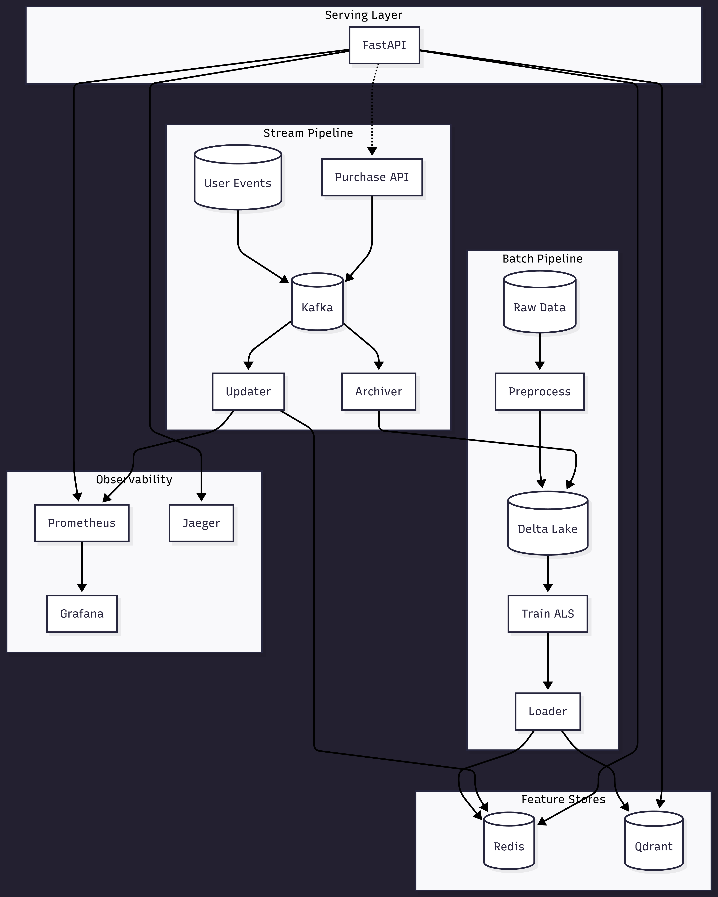

# Real-Time Recommendation System

A real-time product recommendation engine using collaborative filtering (ALS) with online learning capabilities. The system combines batch-trained embeddings with real-time user profile updates to deliver personalized recommendations.

## Data

This project uses the [H&M Personalized Fashion Recommendations](https://www.kaggle.com/competitions/h-and-m-personalized-fashion-recommendations/data) dataset from Kaggle.

## Architecture



The system consists of three main components:

**Batch Pipeline** - Apache Spark jobs that:
- Preprocess raw transaction data into Delta Lake format
- Train ALS collaborative filtering model to generate user/item embeddings
- Load embeddings to Redis (users) and Qdrant (items)
- Calculate trending items as fallback recommendations

**Stream Pipeline** - Real-time processing that:
- Consumes user events (clicks, add-to-cart, purchases) from Kafka
- Updates user vectors in Redis using online learning (exponential moving average)
- Archives events to Delta Lake for batch retraining

**Serving Layer** - FastAPI endpoint that:
- Queries user vectors from Redis
- Performs ANN search in Qdrant to find similar items
- Falls back to trending items for cold-start users

## Tech Stack

| Component | Technology |
|-----------|------------|
| Batch Processing | Apache Spark, Delta Lake |
| ML Model | ALS (Alternating Least Squares) |
| Message Queue | Apache Kafka |
| Stream Archiving | Spark Structured Streaming |
| Vector Database | Qdrant |
| Feature Store | Redis |
| API | FastAPI |

## Project Structure

```
src/
├── batch/                 # Batch processing jobs
│   ├── csv_to_delta.py    # Convert raw CSV to Delta Lake
│   ├── preprocess.py      # ETL: raw data -> training data
│   ├── train_als.py       # Train ALS model
│   ├── loader.py          # Load embeddings to Redis/Qdrant
│   └── calc_popular.py    # Calculate trending items
├── stream/                # Real-time processing
│   ├── producer.py        # Event simulator
│   ├── updater.py         # Online learning consumer
│   └── archiver.py        # Archive events to Delta Lake
├── serve/                 # API layer
│   ├── api.py             # FastAPI recommendation endpoint
│   ├── dependencies.py    # Dependency injection
│   └── schemas.py         # Pydantic models
├── config.py              # Configuration
└── logging.py             # Logging setup
```

## Getting Started

### Prerequisites

- Python 3.13+
- Docker and Docker Compose
- Java 17+ (for Spark)

### Installation

```bash
# Clone and install dependencies
git clone <repository>
cd real-time-recommendation
uv sync --dev

# Start infrastructure
docker-compose up -d
```

### Running the Pipeline

1. **Prepare data** - Place raw CSV files in `data/raw/`

2. **Run batch pipeline**:
   ```bash
   uv run scripts/run_batch.py
   ```
   This runs all batch steps in order: CSV to Delta, preprocess, train ALS, load to stores, calculate popular items.

3. **Start stream processing**:
   ```bash
   # Terminal 1: Event producer (simulator)
   uv run -m src.stream.producer

   # Terminal 2: Online learning
   uv run -m src.stream.updater

   # Terminal 3: Archive events to Delta Lake
   uv run -m src.stream.archiver
   ```

4. **Start API**:
   ```bash
   uv run -m src.serve.api
   ```

5. **Get recommendations**:
   ```bash
   curl http://localhost:8000/recommend/123?k=10
   ```

## API Endpoints

| Endpoint | Description |
|----------|-------------|
| `GET /recommend/{user_id}` | Get personalized recommendations |
| `GET /health/live` | Liveness probe |
| `GET /health/ready` | Readiness probe (checks Redis/Qdrant) |
